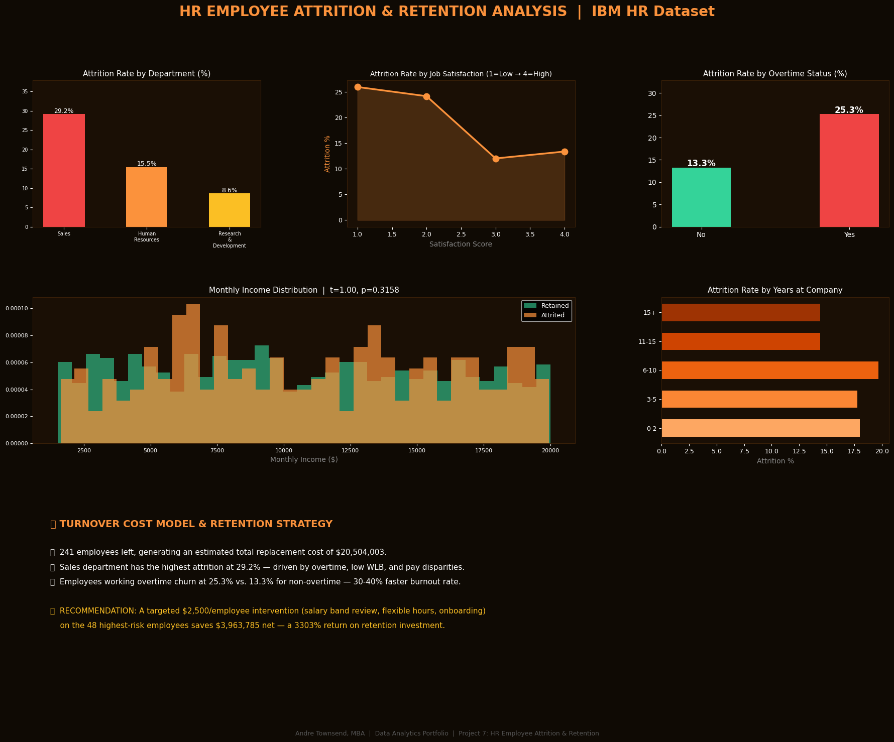

# HR Employee Attrition & Retention Analysis

## Executive Summary
This project analyzes employee attrition using a simulated HR dataset modeled after the IBM HR Analytics dataset. The goal is to identify key drivers of employee turnover and quantify the financial impact of attrition on an organization.

The analysis reveals that overtime, department and early tenure are major contributors to employee churn. A cost model shows that targeted retention strategies can generate significant financial returns.

---

## Business Problem
Employee attrition is a costly challenge for organizations, leading to:
- Increased recruitment and training costs  
- Loss of productivity and institutional knowledge  
- Lower employee morale  

**Key Questions:**
- What factors drive employee attrition?  
- Which groups are at the highest risk?  
- How much does attrition cost the business?  
- Can targeted interventions reduce turnover profitably?  

---

## Methodology
- **Dataset:**
  - Simulated HR dataset (1,470 employees)
  - Based on IBM HR Analytics structure  

- **Data Processing:**
  - Python (`pandas`, `numpy`)  
  - Feature engineering (tenure groups, attrition probability)

- **Statistical Analysis:**
  - T-test comparing the income of attrited vs retained employees  
  - Attrition rate calculations by department, overtime, and tenure  

- **Business Modeling:**
  - Turnover cost estimation  
  - ROI analysis for retention strategies  

- **Visualization:**
  - `matplotlib`, `seaborn`  
  - Multi-chart dashboard  

---

## Key Visualizations

### Charts Included:
- Attrition Rate by Department  
- Attrition vs Job Satisfaction  
- Overtime Impact on Attrition  
- Income Distribution (Statistical Test)  
- Attrition by Years at Company  
- Turnover Cost & Retention Strategy Summary  

---

## Key Findings

### 1. Sales Department Has Highest Attrition
- Sales show the highest turnover (~29%)  
- Likely driven by performance pressure and workload  

### 2. Overtime Significantly Increases Attrition
- Overtime employees: **25.3% attrition**  
- Non-overtime employees: **13.3% attrition**  
- Indicates burnout as a key driver  

### 3. Early Tenure Employees Are Most At Risk
- Employees with **<3 years** at the company have higher attrition  
- Suggests onboarding and engagement gaps  

### 4. Income Is NOT a Significant Factor
- T-test shows **no statistically significant difference**  
- Compensation alone does not explain turnover  

### 5. Attrition Has Major Financial Impact
- Total turnover cost: **~$20.5M**  
- Reducing attrition by 20% yields:
  - **$4.08M savings**
  - **~$3.96M net benefit after intervention costs**

---

## Skills Demonstrated

- **Data Analysis:** Pandas, NumPy  
- **Statistical Testing:** Hypothesis testing (T-test)  
- **Data Visualization:** Matplotlib, Seaborn  
- **Business Analytics:** Cost modeling, ROI analysis  
- **Feature Engineering & Simulation**  
- **Data Storytelling & Insight Generation**  
- **Power BI Data Preparation (CSV export)**  

---

## Tools & Technologies
- Python  
- Pandas  
- NumPy  
- Matplotlib  
- Seaborn  
- SciPy  

---

## Next Steps

- Use **real HR datasets** (IBM, Kaggle, enterprise data)  
- Build **predictive models**:
  - Logistic Regression  
  - Random Forest / XGBoost  
- Develop an **attrition risk scoring system**  
- Create an **interactive Power BI dashboard**  
- Segment analysis by:
  - Gender  
  - Role level  
  - Performance rating  
- Implement and test **real retention strategies**  

--

## Author
**Andre Townsend, MBA**  
Data Analytics Portfolio  

---

## 💡 Final Insight
Employee attrition is not just an HR issue — it is a **financial and strategic problem**.  
Organizations that proactively identify risk factors and invest in retention will gain a strong competitive advantage.
